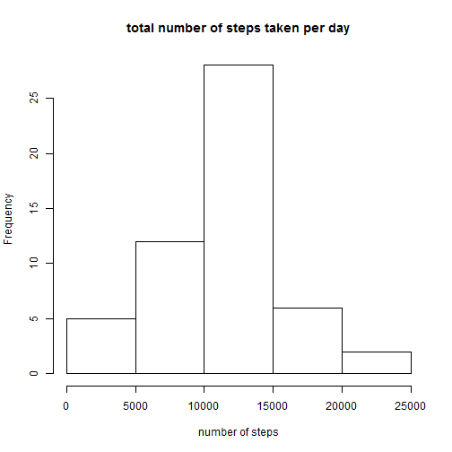
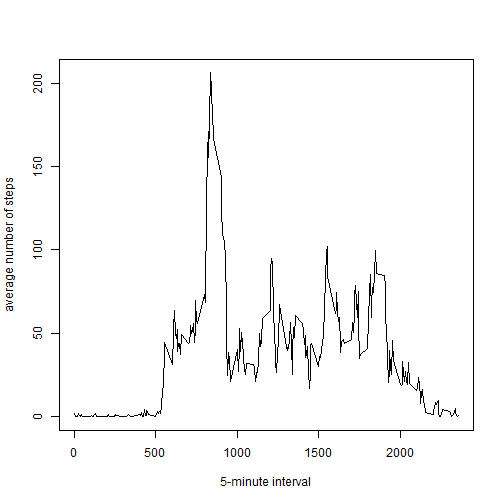
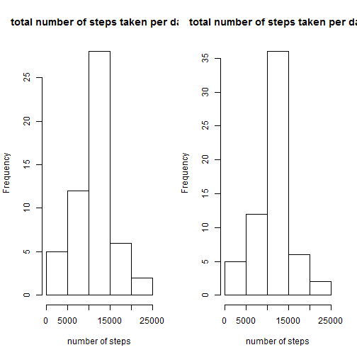
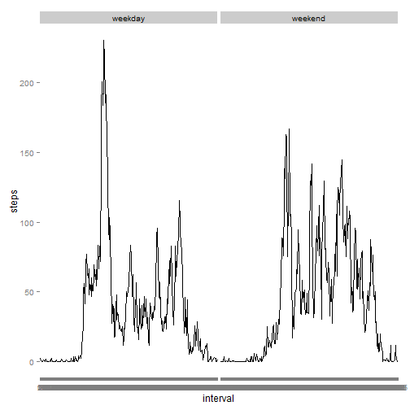

## Loading and preprocessing the data

```r
setwd("F:/PHBS/自学/编程/R/8. Reproducible research/project/1")
activity = read.csv("activity.csv")
```

## What is mean total number of steps taken per day?
(ignore the missing values in the dataset)

1.Calculate the total number of steps taken per day
The total number of steps taken per day is as follows:

```r
numSteps = tapply(activity$steps, activity$date, sum)
numSteps
```

```
## 2012-10-01 2012-10-02 2012-10-03 2012-10-04 2012-10-05 2012-10-06 
##         NA        126      11352      12116      13294      15420 
## 2012-10-07 2012-10-08 2012-10-09 2012-10-10 2012-10-11 2012-10-12 
##      11015         NA      12811       9900      10304      17382 
## 2012-10-13 2012-10-14 2012-10-15 2012-10-16 2012-10-17 2012-10-18 
##      12426      15098      10139      15084      13452      10056 
## 2012-10-19 2012-10-20 2012-10-21 2012-10-22 2012-10-23 2012-10-24 
##      11829      10395       8821      13460       8918       8355 
## 2012-10-25 2012-10-26 2012-10-27 2012-10-28 2012-10-29 2012-10-30 
##       2492       6778      10119      11458       5018       9819 
## 2012-10-31 2012-11-01 2012-11-02 2012-11-03 2012-11-04 2012-11-05 
##      15414         NA      10600      10571         NA      10439 
## 2012-11-06 2012-11-07 2012-11-08 2012-11-09 2012-11-10 2012-11-11 
##       8334      12883       3219         NA         NA      12608 
## 2012-11-12 2012-11-13 2012-11-14 2012-11-15 2012-11-16 2012-11-17 
##      10765       7336         NA         41       5441      14339 
## 2012-11-18 2012-11-19 2012-11-20 2012-11-21 2012-11-22 2012-11-23 
##      15110       8841       4472      12787      20427      21194 
## 2012-11-24 2012-11-25 2012-11-26 2012-11-27 2012-11-28 2012-11-29 
##      14478      11834      11162      13646      10183       7047 
## 2012-11-30 
##         NA
```

2.Make a histogram of the total number of steps taken each day

```r
hist(numSteps, 
     xlab = "number of steps", 
     main = "total number of steps taken per day")
```

 

3.Calculate and report the mean and median of the total number of steps taken per day

```r
mean(numSteps, na.rm = TRUE)
```

```
## [1] 10766.19
```

```r
median(numSteps, na.rm = TRUE)
```

```
## [1] 10765
```
The mean of the total number of steps taken per day is 10766.19.
The median of the total number of steps taken per day is 10765.

## What is the average daily activity pattern?

1.Make a time series plot (i.e. type = "l") of the 5-minute interval (x-axis) and the average number of steps taken, averaged across all days (y-axis)


```r
summary(activity)
```

```
##      steps                date          interval     
##  Min.   :  0.00   2012-10-01:  288   Min.   :   0.0  
##  1st Qu.:  0.00   2012-10-02:  288   1st Qu.: 588.8  
##  Median :  0.00   2012-10-03:  288   Median :1177.5  
##  Mean   : 37.38   2012-10-04:  288   Mean   :1177.5  
##  3rd Qu.: 12.00   2012-10-05:  288   3rd Qu.:1766.2  
##  Max.   :806.00   2012-10-06:  288   Max.   :2355.0  
##  NA's   :2304     (Other)   :15840
```

```r
numStepsInterval = tapply(activity$steps, activity$interval, mean, na.rm = TRUE)
plot(rownames(numStepsInterval), numStepsInterval, 
     type = "l",
     xlab = "5-minute interval",
     ylab = "average number of steps")
```

 

2.Which 5-minute interval, on average across all the days in the dataset, contains the maximum number of steps?

```r
maxSteps = max(numStepsInterval)
index = match(maxSteps, numStepsInterval)
activity$interval[104]
```

```
## [1] 835
```
We can see that the 835 5-minute interval contains the maximum number of steps.

## Imputing missing values

1.Calculate and report the total number of missing values in the dataset (i.e. the total number of rows with NAs)

```r
sum(is.na(activity$steps))
```

```
## [1] 2304
```
The total number of missing values is 2304.

2.Devise a strategy for filling in all of the missing values in the dataset.

```r
activity2 = activity
activity2$steps[is.na(activity2$steps)] <- numStepsInterval[as.character(activity2$interval[is.na(activity2$steps)])]
```
I use the mean for that 5-minute interval to fill in the missing values.

3.Create a new dataset that is equal to the original dataset but with the missing data filled in.
The new dataset is activity2 as shown above. 

4.Make a histogram of the total number of steps taken each day and Calculate and report the mean and median total number of steps taken per day. Do these values differ from the estimates from the first part of the assignment? What is the impact of imputing missing data on the estimates of the total daily number of steps?

```r
numSteps2 = tapply(activity2$steps, activity2$date, sum)
numSteps2
```

```
## 2012-10-01 2012-10-02 2012-10-03 2012-10-04 2012-10-05 2012-10-06 
##   10766.19     126.00   11352.00   12116.00   13294.00   15420.00 
## 2012-10-07 2012-10-08 2012-10-09 2012-10-10 2012-10-11 2012-10-12 
##   11015.00   10766.19   12811.00    9900.00   10304.00   17382.00 
## 2012-10-13 2012-10-14 2012-10-15 2012-10-16 2012-10-17 2012-10-18 
##   12426.00   15098.00   10139.00   15084.00   13452.00   10056.00 
## 2012-10-19 2012-10-20 2012-10-21 2012-10-22 2012-10-23 2012-10-24 
##   11829.00   10395.00    8821.00   13460.00    8918.00    8355.00 
## 2012-10-25 2012-10-26 2012-10-27 2012-10-28 2012-10-29 2012-10-30 
##    2492.00    6778.00   10119.00   11458.00    5018.00    9819.00 
## 2012-10-31 2012-11-01 2012-11-02 2012-11-03 2012-11-04 2012-11-05 
##   15414.00   10766.19   10600.00   10571.00   10766.19   10439.00 
## 2012-11-06 2012-11-07 2012-11-08 2012-11-09 2012-11-10 2012-11-11 
##    8334.00   12883.00    3219.00   10766.19   10766.19   12608.00 
## 2012-11-12 2012-11-13 2012-11-14 2012-11-15 2012-11-16 2012-11-17 
##   10765.00    7336.00   10766.19      41.00    5441.00   14339.00 
## 2012-11-18 2012-11-19 2012-11-20 2012-11-21 2012-11-22 2012-11-23 
##   15110.00    8841.00    4472.00   12787.00   20427.00   21194.00 
## 2012-11-24 2012-11-25 2012-11-26 2012-11-27 2012-11-28 2012-11-29 
##   14478.00   11834.00   11162.00   13646.00   10183.00    7047.00 
## 2012-11-30 
##   10766.19
```

```r
par(mfrow = c(1,2))
hist(numSteps, 
     xlab = "number of steps", 
     main = "total number of steps taken per day")
hist(numSteps2, 
     xlab = "number of steps", 
     main = "total number of steps taken per day")
```

 

```r
mean(numSteps2)
```

```
## [1] 10766.19
```

```r
median(numSteps2)
```

```
## [1] 10766.19
```
These values vary a little from the estimates from the first part of the assignment. The mean and median are both 10766.19 for the new dataset. And the data are more centered in general. 

## Are there differences in activity patterns between weekdays and weekends?

1.Create a new factor variable in the dataset with two levels �C “weekday” and “weekend” indicating whether a given date is a weekday or weekend day.

```r
temp = weekdays(as.Date(activity2$date))
activity2$day = rep(NA, 17568)
activity2$day[temp %in% c("星期六", "星期日")] <- "weekend"
activity2$day[is.na(activity2$day)] <- "weekday"
activity2$day = as.factor(activity2$day)
str(activity2$day)
```

```
##  Factor w/ 2 levels "weekday","weekend": 1 1 1 1 1 1 1 1 1 1 ...
```
The created variable "day" indicates whether it is weekday or weekend. 

2.Make a panel plot containing a time series plot (i.e. type = "l") of the 5-minute interval (x-axis) and the average number of steps taken, averaged across all weekday days or weekend days (y-axis). 

```r
library(reshape2)
activity2Melt = melt(activity2, id = c("interval", "day"), measure.vars = c("steps"))
activity2Cast = dcast(activity2Melt, day ~ interval, mean)
activity2Cast2 <- melt(activity2Cast, id.vars="day", value.name = "steps", variable.name="interval")
library(ggplot2)
ggplot(data = activity2Cast2, aes(x=interval, y=steps, group = day)) + 
    geom_line() + 
    facet_grid(. ~ day)
```

 
We can see that in weekdays steps tend to be more concentrated than weekend. 
